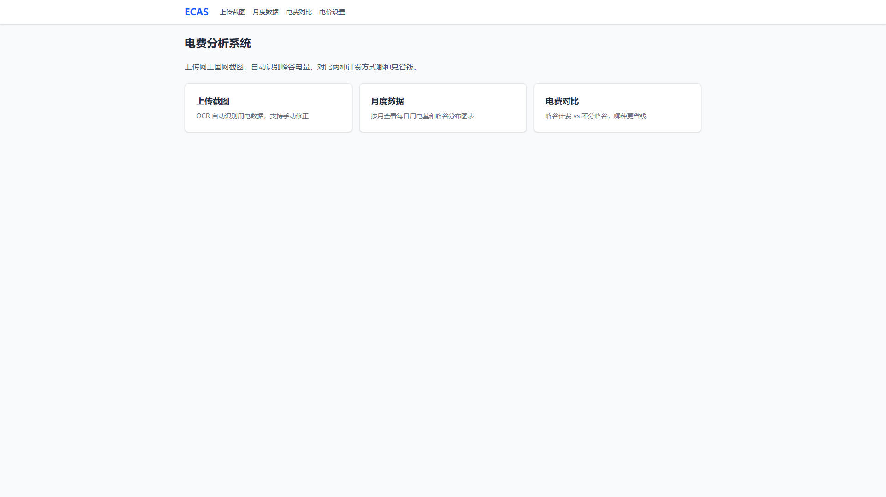
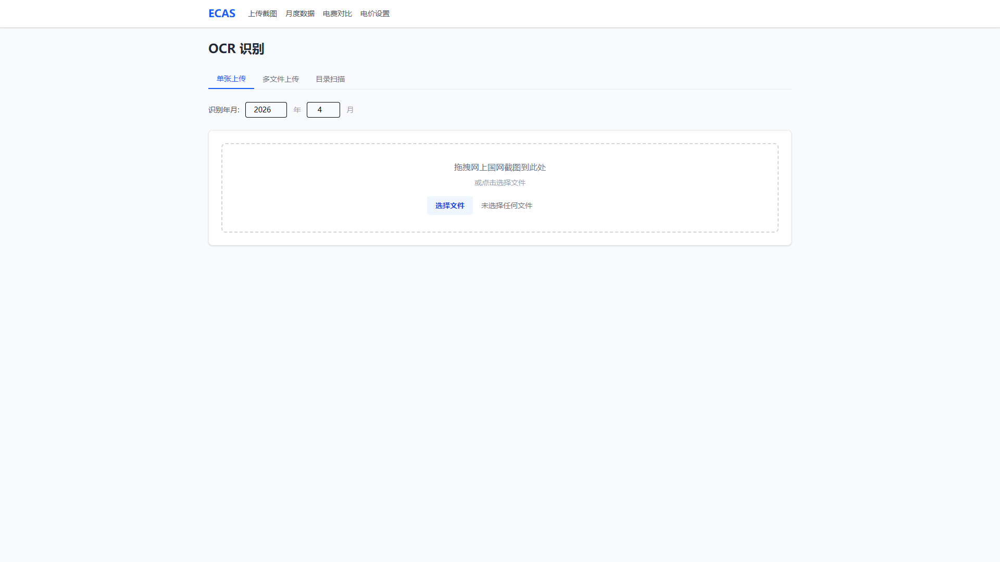
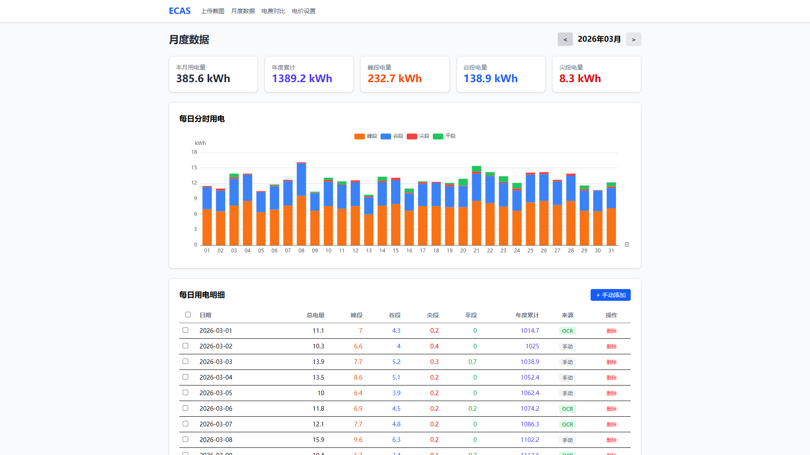
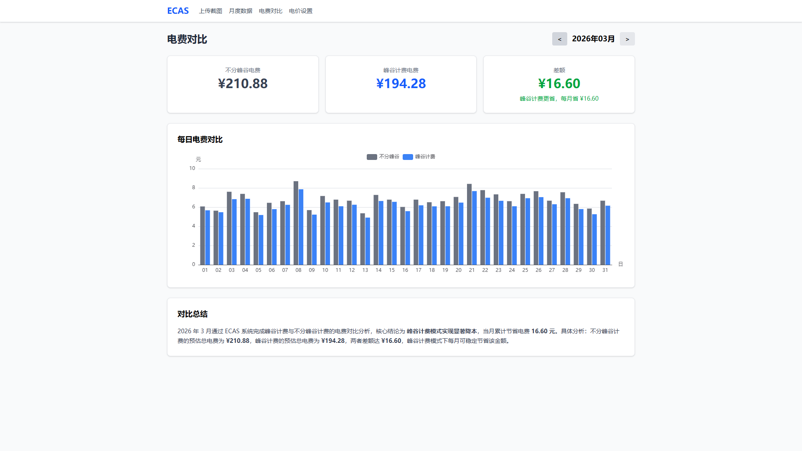
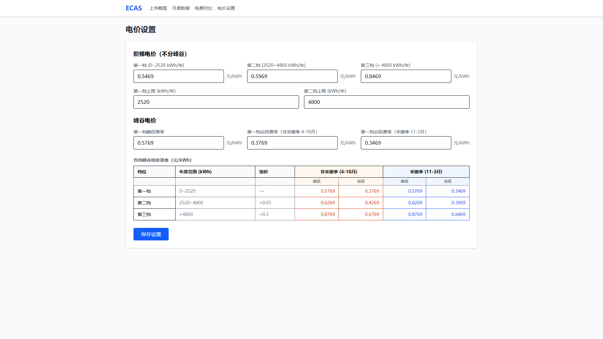

# 电费分析工具

从国家电网官方 APP 截图中自动提取用电数据，对比阶梯电价与峰谷电价，帮你选最省钱的计费方案。

## 功能

- **OCR 自动识别** — 上传电表截图，自动提取每日用电量
- **三种上传方式** — 单张上传、多文件上传、目录批量扫描
- **电费对比** — 自动计算阶梯电价 vs 峰谷电价，直观展示差额
- **年度累计计费** — 按年度累计电量确定阶梯档位，符合实际计费规则
- **采暖季支持** — 自动识别采暖季（11月-3月），应用特殊谷段费率
- **自定义电价** — 支持修改阶梯分档、峰谷费率等参数
- **异常数据检测** — 自动标记零值、负值、分量缺失等异常记录

### 支持者功能（¥9/月赞助解锁）

- **多电表管理** — 支持多个电表独立追踪（家庭/出租房/公司）

### 高级功能（¥30/月赞助解锁）

- **高级图表** — 同比/环比对比、用电趋势预测
- **高级电价策略** — 多地区策略、自定义阶梯、组合计费
- **PDF 年度报告** — 生成年度用电分析报告 PDF

## 功能截图

| 首页 | OCR 上传 |
|:---:|:---:|
|  |  |

| 月度数据 | 电费对比 |
|:---:|:---:|
|  |  |

**电价设置**



## 技术栈

| 层 | 技术 |
|---|------|
| 后端 | Flask + SQLAlchemy + SQLite |
| 前端 | Vue 3 + Vite + TailwindCSS + ECharts |
| OCR | RapidOCR / Tesseract / PaddleOCR（三引擎回退） |

## 快速开始

### 环境要求

- Python 3.10 ~ 3.12（推荐 3.12）
- Node.js 18+

### 后端

```bash
cd backend
python -m venv .venv
source .venv/bin/activate  # Windows: .venv\Scripts\activate
pip install -r requirements.txt
flask run
```

后端运行在 http://localhost:5000

### 前端

```bash
cd frontend
npm install
npm run dev
```

前端运行在 http://localhost:3000，自动代理 `/api` 到后端。

## 使用方法

1. 打开浏览器访问 http://localhost:3000
2. 在"上传"页面，上传国家电网官方 APP（"网上国网"）的用电详情截图
3. OCR 识别后勾选要保存的记录，点击保存
4. 在"月度数据"页面查看用电明细和年度累计
5. 在"电费对比"页面查看两种计费方案的差异

## 项目结构

```
├── backend/
│   ├── api/              # Flask 蓝图（usage, billing, screenshot, policy）
│   ├── models/           # SQLAlchemy 模型
│   ├── services/         # 业务逻辑（计费引擎、OCR、数据服务）
│   ├── utils/            # 工具函数（解析器、日志）
│   └── app.py            # 应用入口
├── frontend/
│   └── src/
│       ├── api/          # Axios API 封装
│       ├── components/   # Vue 组件
│       ├── stores/       # Pinia 状态管理
│       └── views/        # 页面视图
├── data/                 # 数据库和上传文件（gitignore）
└── docs/                 # 项目文档
```

## 默认电价（山东居民）

| 档位 | 年度范围 | 不分峰谷 | 峰段 | 谷段 |
|------|---------|---------|------|------|
| 一档 | 0~2520 kWh | 0.5469 | 0.5769 | 0.3769 |
| 二档 | 2520~4800 kWh | 0.5969 | +0.05 | +0.05 |
| 三档 | >4800 kWh | 0.8469 | +0.30 | +0.30 |

采暖季（11月-3月）谷段费率额外降低 0.03 元。

> 电价可在"设置"页面自定义，支持其他省份。

## 赞助支持

如果这个工具帮到了你，欢迎通过爱发电支持持续维护和更新：

[](https://ifdian.net/a/smart-ebocr)

| 档位 | 价格 | 权益 |
|------|------|------|
| 支持者 | ¥9/月 | 多电表管理 + 感谢名单展示 |
| 高级用户 | ¥30/月 | 高级图表 + 高级电价 + PDF 导出 |
| 超级用户 | ¥99/月 | 全部功能 + 功能投票 + 优先支持 |

## License

本项目采用 Open Core 双协议模式：

- **核心功能**：[Apache 2.0](LICENSE) — 可自由使用、修改、分发
- **高级功能**：[商业授权](LICENSE.COMMERCIAL) — 通过爱发电赞助获取使用许可

## 免责声明

本项目为个人开发的非官方工具，与国家电网有限公司（SGCC）及其"网上国网"APP 无任何关联、授权或背书关系。"网上国网"是国家电网有限公司的商标/服务标识，本项目仅出于描述兼容性目的提及该名称。
